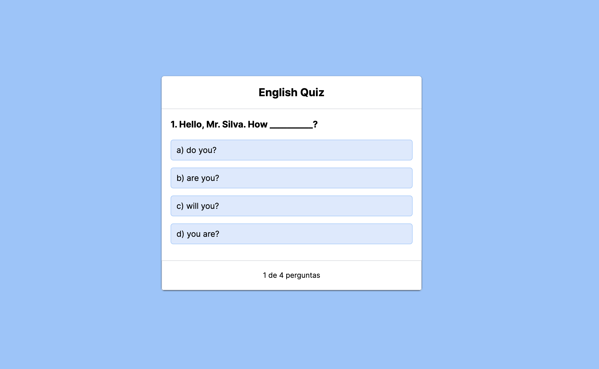

## English Quiz

A aplicação **English Quiz** foi desenvolvida durante o módulo Estados e Eventos do curso de React com TypeScript, do B7Web. O quiz conta com 4 perguntas de inglês nível iniciante, permitindo ao usuário selecionar uma das 4 alternativas, indicando o acerto ou erro. Ao final, será exibida a alternativa escolhida em cada pergunta, bem como um feedback se a resposta foi correta ou não.

<div align="center"> 
  
</div>

## 🔗 Acesse o deploy da aplicação

[](https://quiz-b7web.vercel.app/)

## 🛠️ Tecnologias

- [Next.js](https://nextjs.org/)
- [TypeScript](https://www.typescriptlang.org/)
- [React](https://react.dev/)
- [Tailwind CSS](https://tailwindcss.com/)

## 💻 Rodando o projeto localmente
```bash
# Clone este repositório
$ git clone https://github.com/welisonw/quiz-b7web.git

# Instale as dependências
$ npm install  or  yarn install

# Inicie o projeto
$ npm run dev  or  yarn dev

# O app vai inicializar em http://localhost:3000
```
